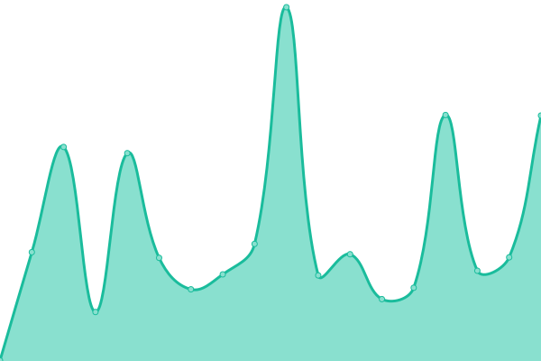

# [📈 Live Status](https://ditchthis.github.io/upptime-monitoring): <!--live status--> **🟨 Degraded performance**

This repository contains the open-source uptime monitor and status page for [ditchthis](https://ditchthis.github.io/upptime-monitoring), powered by [Upptime](https://github.com/upptime/upptime).

With [Upptime](https://upptime.js.org), you can get your own unlimited and free uptime monitor and status page, powered entirely by a GitHub repository. We use [Issues](https://github.com/ditchthis/upptime-monitoring/issues) as incident reports, [Actions](https://github.com/ditchthis/upptime-monitoring/actions) as uptime monitors, and [Pages](https://ditchthis.github.io/upptime-monitoring) for the status page.

<!--start: status pages-->
<!-- This summary is generated by Upptime (https://github.com/upptime/upptime) -->
<!-- Do not edit this manually, your changes will be overwritten -->
<!-- prettier-ignore -->
| URL | Status | History | Response Time | Uptime |
| --- | ------ | ------- | ------------- | ------ |
|  [Website](https://ditchcarbon.com/) | 🟩 Up | [website.yml](https://github.com/ditchthis/upptime-monitoring/commits/HEAD/history/website.yml) | 

 522ms
     
 | 

<a href="https://ditchthis.github.io/upptime-monitoring/history/website">100.00%</a>
    

|  [Client Portal](https://portal.ditchcarbon.com/) | 🟩 Up | [client-portal.yml](https://github.com/ditchthis/upptime-monitoring/commits/HEAD/history/client-portal.yml) | 

 556ms
     
 | 

<a href="https://ditchthis.github.io/upptime-monitoring/history/client-portal">100.00%</a>
    

|  [API Docs](https://docs.ditchcarbon.com/) | 🟩 Up | [api-docs.yml](https://github.com/ditchthis/upptime-monitoring/commits/HEAD/history/api-docs.yml) | 

 452ms
     
 | 

<a href="https://ditchthis.github.io/upptime-monitoring/history/api-docs">100.00%</a>
    

|  [API](https://api.ditchcarbon.com/organizations/227765) | 🟨 Degraded | [api.yml](https://github.com/ditchthis/upptime-monitoring/commits/HEAD/history/api.yml) | 

 4786ms
     
 | 

<a href="https://ditchthis.github.io/upptime-monitoring/history/api">100.00%</a>
    

<!--end: status pages-->

[**Visit our status website →**](https://ditchthis.github.io/upptime-monitoring)

## 📄 License

- Powered by: [Upptime](https://github.com/upptime/upptime)
- Code: [MIT](./LICENSE) © [ditchthis](https://ditchthis.github.io/upptime-monitoring)
- Data in the `./history` directory: [Open Database License](https://opendatacommons.org/licenses/odbl/1-0/)
